## 基于华为UDX710方案的5G通行壳的改装模块固件/教程：
项目基于STM32F1系列单片机实现

项目电路开源地址：[立创开源平台]https://oshwhub.com/unli/5g-ke-chao-ji-you-hua-si-you

## 特别说明

本项目仅发布编译好的二进制固件文件，不提供任何源代码。

许可条款：
1. 允许个人用户下载、安装和使用本固件，仅限非商业用途
2. 不允许修改、反编译、逆向工程本固件的任何部分
3. 不允许二次分发、复制、传播本固件的任何部分
4. 不允许将本固件用于任何商业目的，包括但不限于出售、出租、捆绑销售
5. 本固件按"原样"提供，不提供任何明示或暗示的保证，作者不对使用本固件造成的任何损失负责

违反以上条款的，作者保留追究法律责任的权利。

## 免责声明
本项目提供的固件仅供参考和学习使用，作者不对因使用本固件而导致的任何损失或损害负责。使用者应自行承担使用本固件的风险，并确保在合法和安全的环境下使用。

**注意：本项目不强制付费，不愿付费的可以直接使用V1.X版本的固件**

**以下教程过程中，有任何问题可以付费咨询，链接同固件付费链接：**
【闲鱼】https://m.tb.cn/h.R1uWIX7?tk=Umjd5s9Vpv1 CZ005 「我在闲鱼发布了【特殊专用链接】」

## 下单说明
1、选择导出Gerber或者直接下单

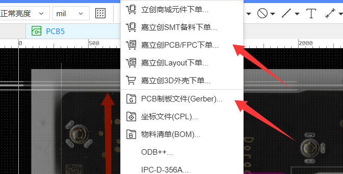
2、点“否”

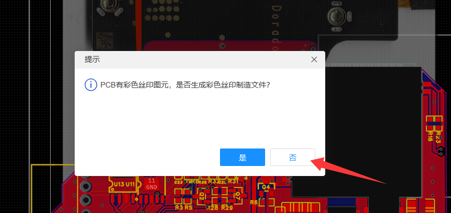

3、点“否，继续下单”

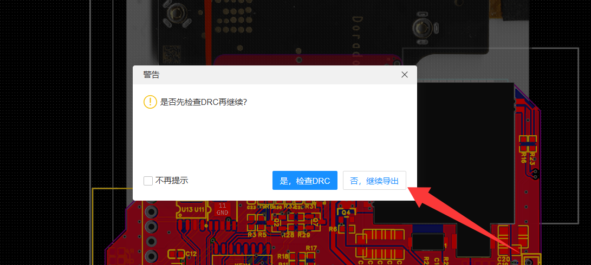

4、下单参数：板厚1mm,选择3313层压，选择+/-20%阻抗，其他参数按免费选（如果不会那么你不适合这个项目）

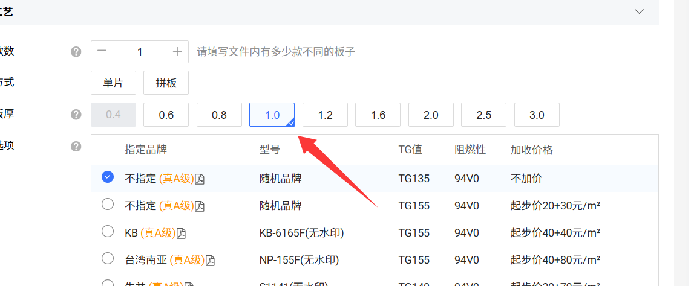
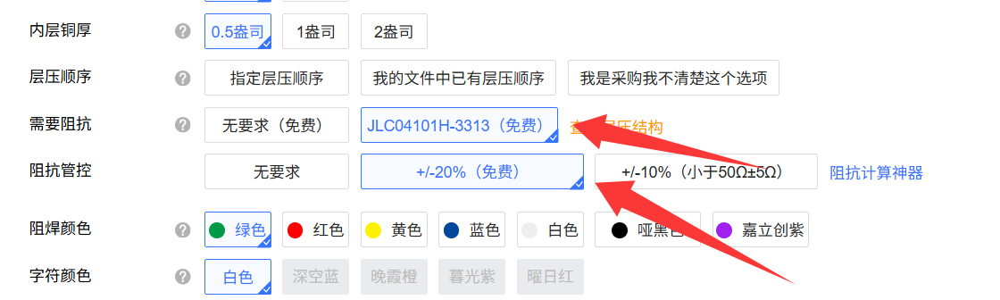

## 组装教程
### 第一部分 接口焊接
必须按照顺序焊接，先焊接24pin排座，再焊接TYPEC接口，typec接口后侧的盖板可以打开，打开后可以通过电烙铁微调焊点。

检查标准：
1、typec接口焊点无连锡
2、24pin排座接点焊接牢固，用镊子一个一个摇晃焊点不松动
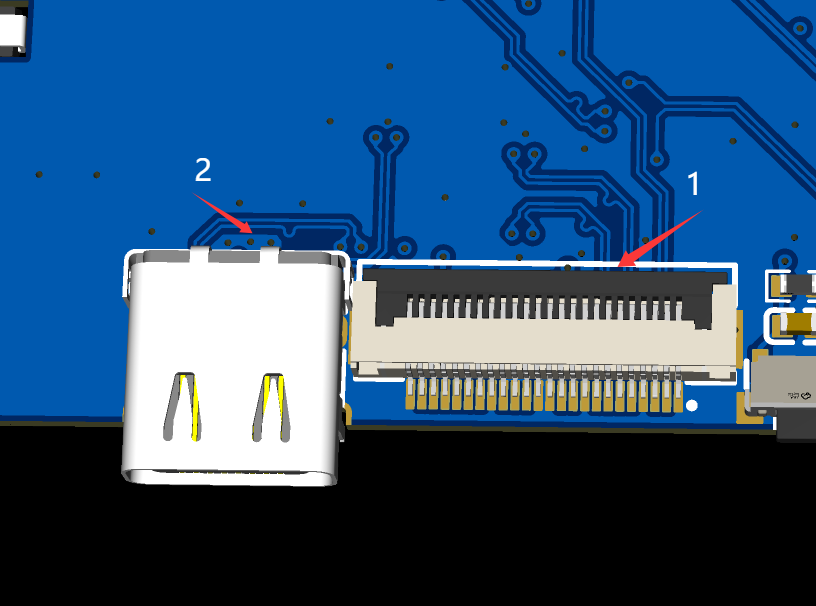

### 第二部分 基础供电组装
依次焊接这三处供电区域

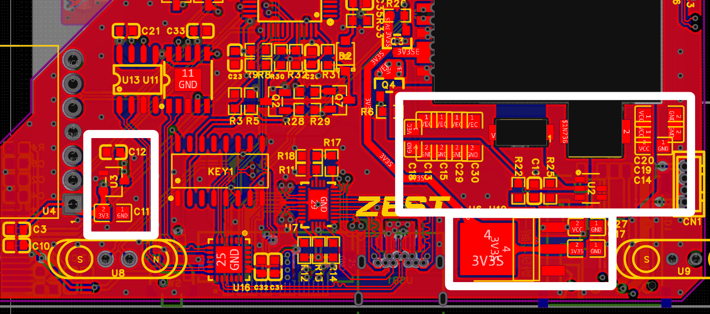
焊接完成后接上typec，测量以下三个点，依次是3.3V、5V、7.8V、3.3V
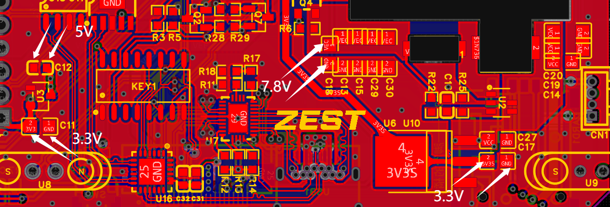

### 第三部分 CH334+CH340组装及校验
1.1、先焊接此处CH334和两颗电容
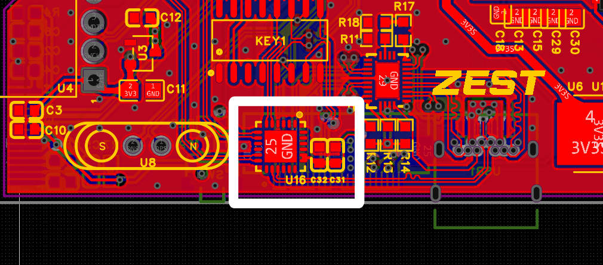
1.2、焊接完成后，将typec插到电脑上，打开电脑上的设备管理器，查看“通用串行总线控制器”下是否有出现“通用USB集线器”
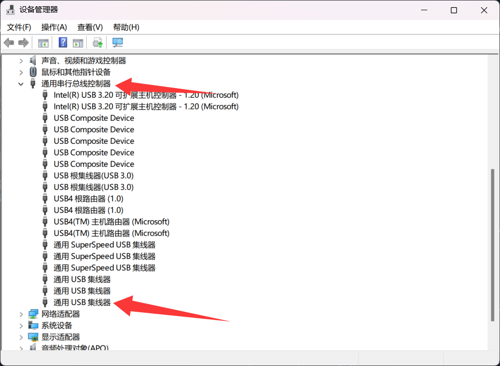

2.1、焊接此处两颗CH340芯片和电容
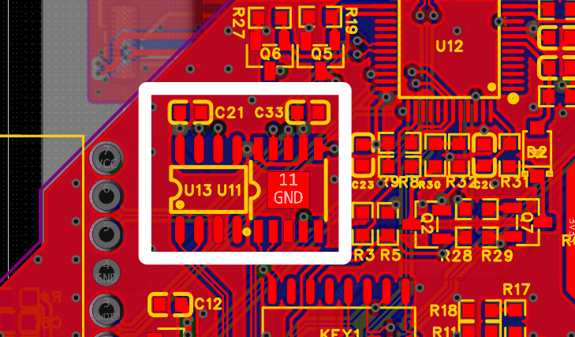
2.2、焊接完成后，将typec插到电脑上，打开电脑上的设备管理器，查看“端口（COM和LPT）”下是否有出现“USB-SERIAL CH340和USB-SERIAL CH340K”
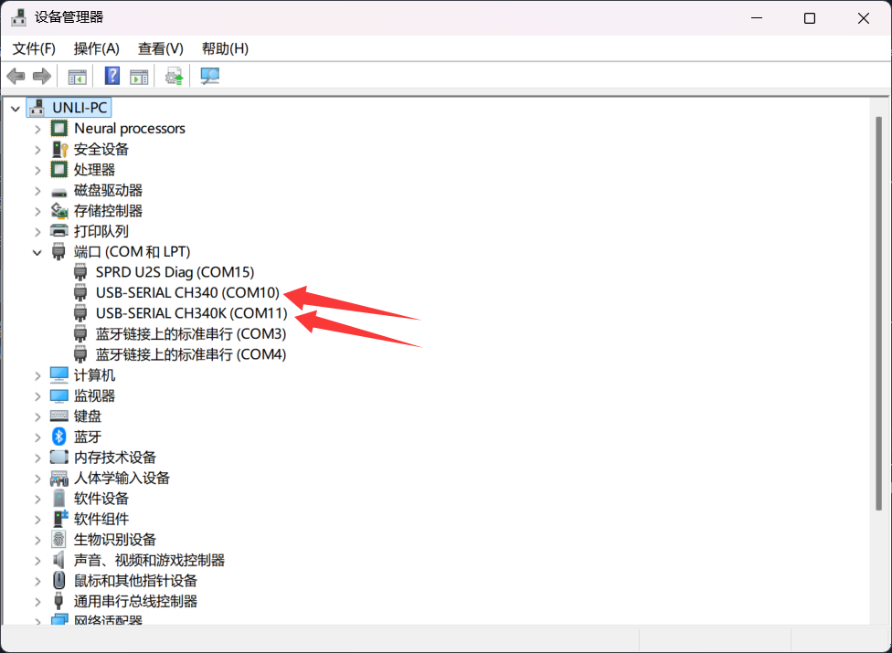

### 第四部分 固件烧录
1、请自行焊接好除7P调试接口以外的所有电路（即下图白框，绿框的磁吸接口也可以先不焊接）
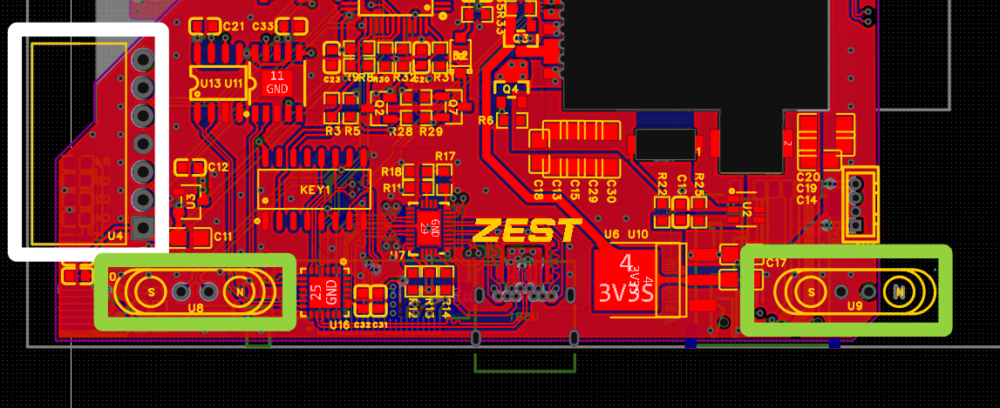

2、焊接完成后，将typec插到电脑上，打开“固件烧录工具”，选择对应的CH340K对应端口，选择系统固件，选择“DTR为低电平，RTS高电平”
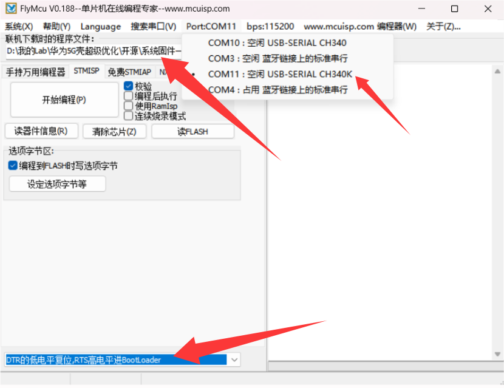

3、点击“开始编程”，右侧应当出现“IF”，带表正常，等待进度条走完。（如有报错，请检查你前面的焊接的单片机和其他电路部分是否短路或者虚焊）
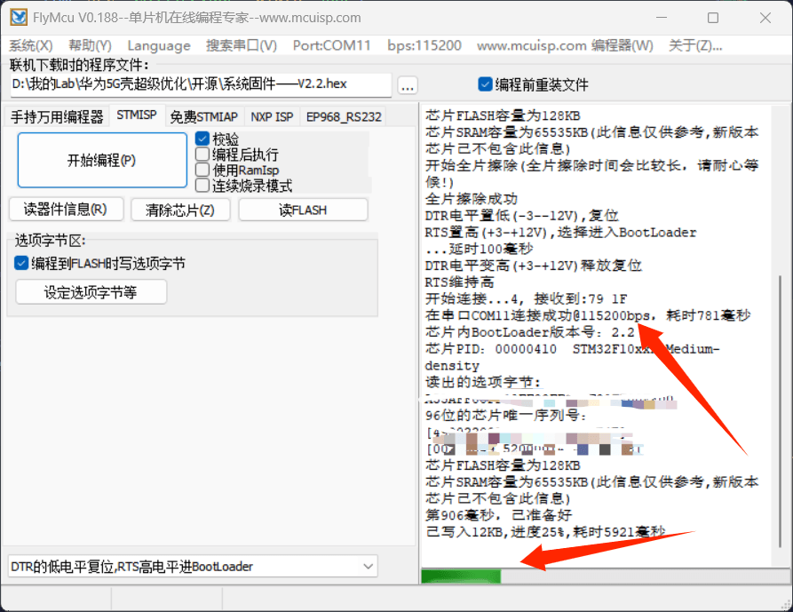

4、下载完成后重新插拔typec，屏幕正常点亮的话，那么恭喜你，成功了

### 如果到此步未成功，请检查你前面的步骤或者咨询我

## 授权教程
1、通过【闲鱼】https://m.tb.cn/h.R1uWIX7?tk=Umjd5s9Vpv1 CZ005 「我在闲鱼发布了【特殊专用链接】」付费9.9后，将屏幕显示授权码发给我，我会给你授权。

2、打开“串口通信工具”,选择对应的CH340K对应端口，选择115200波特率，发送授权码

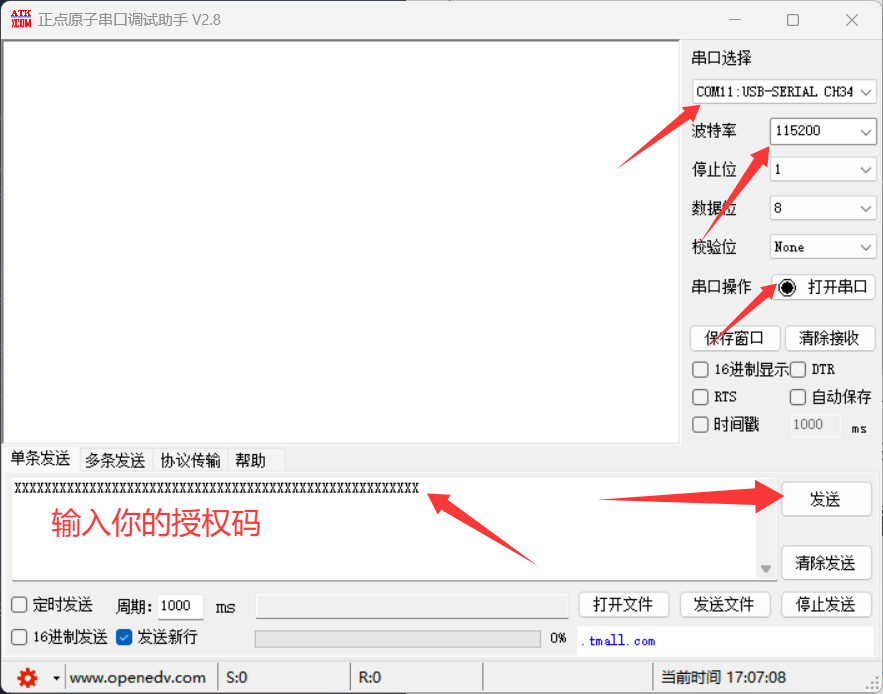

3、授权完成后，屏幕将自动跳转至主页

QQ群：1075838118
